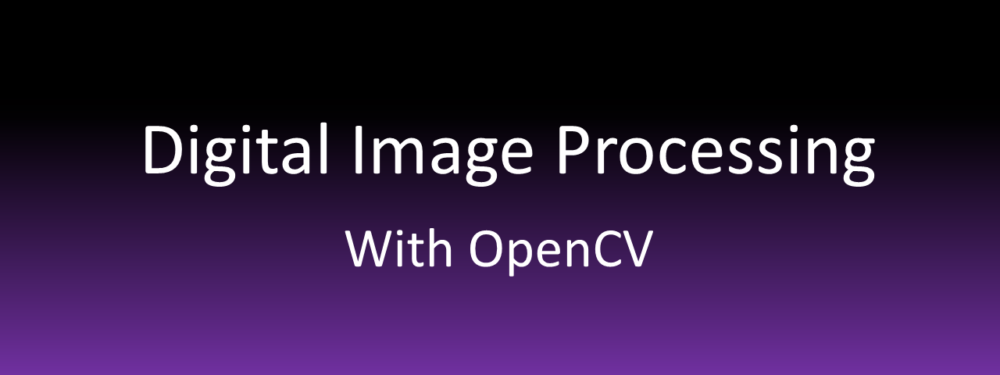

# Digital Image Processing tutorial with OpenCV

<!-- PROJECT LOGO -->
 

  

 

This repository contains slides about DIP and OpenCV tutorial
 

Codes and projects about course 

* <a href=""><strong>Chapter 1</strong></a>
 
* <a href=""><strong>Chapter 2</strong></a>
 
* <a href="https://drive.google.com/drive/folders/1Y02pW49EIn81OrFxff9JK6YaAAoFujd5?usp=sharing"><strong>Chapter 3</strong></a>
 
